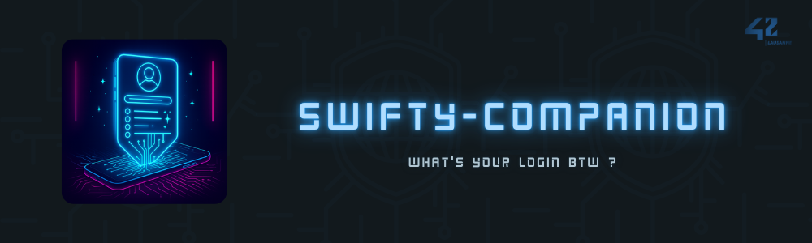

<br>

# Swifty Companion — 42

Application **iOS 17+** en SwiftUI connectée à l’API 42 pour afficher ton profil, rechercher des étudiants, visualiser l’activité du campus et suivre tes projets.  
Design moderne, performances soignées, architecture modulaire prête pour l’évolutivité.

<br>

## Index

- [Aperçu](#aperçu)
- [Fonctionnalités](#fonctionnalités)
- [Architecture & choix techniques](#architecture--choix-techniques)
- [Sécurité & résilience réseau](#sécurité--résilience-réseau)
- [Écrans](#écrans)
- [Configuration & lancement](#configuration--lancement)
- [API utilisées](#api-utilisées)
- [Crédits](#crédits)

<br>

## Aperçu

- Auth 42 OAuth2 via `ASWebAuthenticationSession`, tokens en Keychain, refresh automatique.
- Profil complet : identité, statut/cursus, coalitions, projets en cours/terminés, log time sur 14 jours (Swift Charts).
- Recherche par login, tri biaisé vers ton campus courant.
- Dashboard campus : infos, nombre d’utilisateurs actifs en temps réel, événements à venir.
- Cache local JSON (profil, logs, campus) avec restauration immédiate, auto-refresh périodique.
- UX polie : skeletons & shimmer, haptique, sections réutilisables, filtres en chips, fiches détaillées en sheets.
- Slots d’évaluation : poser des créneaux par segments de 15 min et les supprimer avec confirmation système, états de chargement et retours haptiques.

<br>

## Fonctionnalités

- Authentification sécurisée (OAuth2 « public ») et boucle de rafraîchissement des access tokens.
- **Mon Profil** : avatar, wallet, points de correction, hôte courant, contact, statut/piscine, cursus + progression, coalitions, projets actifs/terminés, log time 14 jours.
- **Recherche d’étudiants** par login, avec résultats contextualisés par campus.
- **Accueil (Home)** : carte d’identité du campus (adresse, site web, effectifs), événements triés chronologiquement.
- **Réglages** : état du compte, validité du jeton, info app, déconnexion.
- **Accessibilité & confort** : états de chargement explicites, erreurs contextualisées avec action Réessayer, haptique, animations snappy.
- **Slots d’évaluation** : poser des créneaux par segments de 15 min et les supprimer avec confirmation système, états de chargement et retours haptiques.

<br>

## Architecture & choix techniques

### Couches principales

#### UI / Views

+ **Écrans** : BootView, LoginView, HomeView, SearchView, SlotsPageView, MyProfileView → UserProfileView.
+ **Composants** : SectionCard, InfoPillRow, CapsuleBadge, LoadingListPlaceholder (+ shimmer), WeeklyLogCard (Charts), CreateSlotSheet.
- **Thème** : usage de `Color("AccentColor")` dynamique selon coalition avec fallback, coins `.continuous`, silhouettes légères, lisibilité prioritaire.

#### Store & Loaders

- **ProfileStore** : point d’accès unique au UserProfileLoader de l’utilisateur connecté.
- **UserProfileLoader** : pipeline orchestré par section (basic/coalitions/projects/host/log) avec états indépendants, cache disque, refresh périodique (300s), fetch parallélisés et protection contre les races (token interne).

#### Données & Mappers

- **Models/UserProfile** + Raw Decodables pour isoler mapping/normalisation (dates ISO, regroupement projets, etc.).
+ **Repositories** : ProfileRepository, CampusRepository, SearchRepository, LocationRepository, SlotsRepository.
- **Caches** : ProfileCache, CampusCache (JSON sérialisés, ISO8601, dossier Caches utilisateur).

#### Réseau

- **APIClient (actor)** : URLSession dédié, retry exponentiel + jitter, gestion 429 Retry-After, 401 auto-refresh, pagination centralisée.
- **SecureImageLoader (actor)** : NSCache (limites mémoire), déduplication des chargements, Authorization auto pour images privées, backoff exponentiel.

#### Auth

- **AuthService (ObservableObject)** : phases (unknown/unauthenticated/authenticated), Keychain pour tokens, UserDefaults pour expiration/login, refresh loop, récupération du login via `/v2/me`, intégration UI, logout propre.

#### Patterns notables

- Actors pour sérialiser l’accès au réseau/cache et éviter les data races.
- États par section pour une UX « progressive enhancement ».
- Sheets unifiées pour détails d’items, Chips pour segmenter par cursus/coalition.
- Charts (Swift Charts) pour le log time, avec barres et statistiques Total/Moyenne.

<br>

## Sécurité & résilience réseau

- Keychain pour access_token et refresh_token.
- ASWebAuthenticationSession avec state aléatoire, redirect_uri vérifiée.
- Boucle de refresh calée sur l’expiration –1 min, replanifiée après chaque renouvellement.
- **APIClient robuste** :
	- 401 → refresh token et relance unique.
	- 429 → respect du Retry-After.
	- 5xx/URLError → exponential backoff + jitter, limites d’essais.
- Images sécurisées : header Authorization injecté pour les URLs de l’API 42.
- Caches avec TTL de 5 minutes côté campus, restauration immédiate hors-ligne.

<br>

## Écrans

- **Boot** : initialisation + détection de session.
- **Login** : bouton unique « Se connecter avec 42 », web auth intégrée, état « Connexion… ».
- **Accueil** : carte campus (nom, adresse, site, effectifs), actifs en temps réel, événements à venir (sheet détail).
- **Recherche** : champ « Rechercher un login… », résultats avec avatar/nom/login, ouverture du profil en plein écran.
+ **Slots** : dépot, suppression et affichage de créneaux d'évaluation (sheet responsive, confirmation, feedback visuel/haptique).
- **Profil** :
	- Identité : avatar, affichage title/login, poste actuel, contact, langue du campus.
	- À propos : statut/piscine, cursus avec chips + niveau et progression.
	- Coalitions : chips de sélection, Score/Rang mis en carte.
	- Log time : histogramme 14 jours + Total et Moyenne.
	- En cours / Terminés : items groupés par cursus, tri chronologique, badge Note/Validé/Retry et lien repo si présent (sheet).
- **Réglages** : login courant, validité du jeton, nom + version de l’app, soumission de bug, déconnexion confirmée.

<br>

## Configuration & lancement

### Prérequis

- iOS 17+, Xcode 15+
- Compte et application API 42 (Intra) avec redirect URI propre à l’app.

### 1. Secrets & redirect

Dans `Info.plist`, renseigne les clés suivantes (valeurs d’exemple) :

```plaintext
API_CLIENT_ID = xxxxxxxxxxxxxxxxxxxxxxxxxxxxxxxxxxxxxxxxxxxxxxxx
API_CLIENT_SECRET = yyyyyyyyyyyyyyyyyyyyyyyyyyyyyyyyyyyyyyyyyyyy
API_REDIRECT_URI = myapp42://oauth/callback
```

Ajoute un URL Type dans le target iOS avec le Scheme de la redirect URI (`myapp42` dans l’exemple).  
Dans le dashboard 42, configure la Redirect URI exacte.

### 2. Build & run

- Sélectionne un device iOS 17+, Build puis Run.
- Écran Login → « Se connecter avec 42 » → consentement → retour à l’app.
- Les tokens sont stockés en Keychain et rafraîchis automatiquement.

<br>

## API utilisées

- `GET /v2/me` — login courant, campus primaire.
- `GET /v2/users/{login}` — profil de base + titres, cursus, achievements.
- `GET /v2/users/{login}/coalitions`
- `GET /v2/users/{login}/coalitions_users`
- `GET /v2/users/{login}/projects_users` — paginé
- `GET /v2/users/{login}/locations` — actif/récent
- `GET /v2/users/{login}/locations_stats` — agrégats horaires (fallback si indisponible → agrégation manuelle des locations)
- `GET /v2/campus/{id}` — infos campus
- `GET /v2/campus/{id}/locations` — paginé, actifs
- `GET /v2/campus/{id}/events` — paginé, futurs
- `GET /v2/users?search[login]=…` — recherche, page[size]
- `GET /v2/me/slots` — créneaux de l’utilisateur courant (journée).
- `POST /v2/slots` — création d’un créneau d’évaluation.
- `DELETE /v2/slots/{id}` — suppression d’un créneau.

Gestion centralisée des pages et du header Link côté APIClient.

<br>

## Captures d'écran

### Home

<div align="center">
	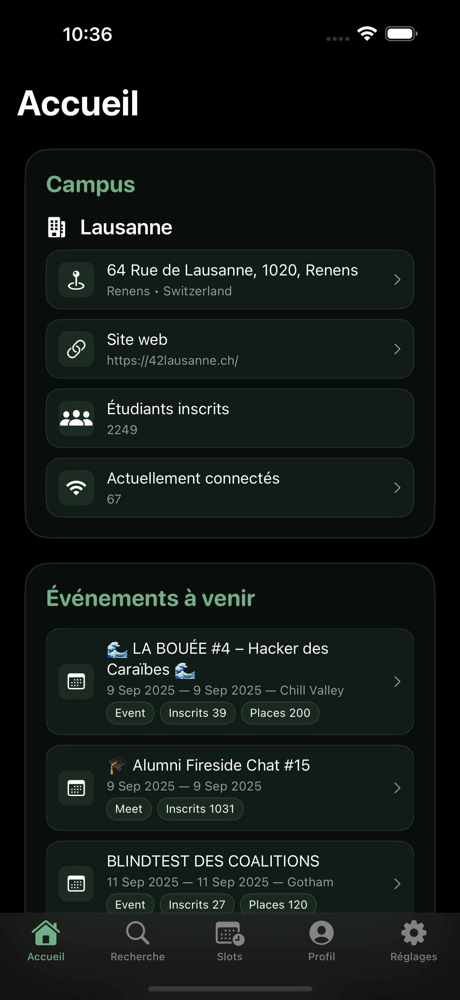
	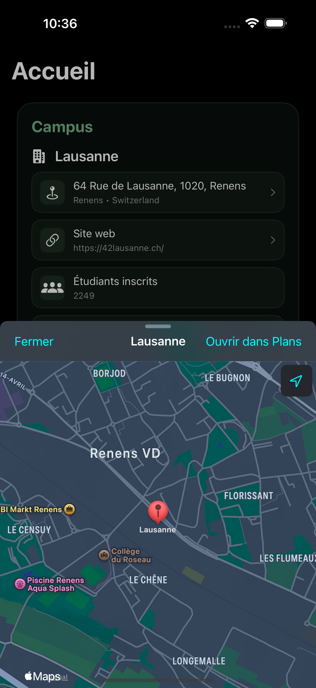
	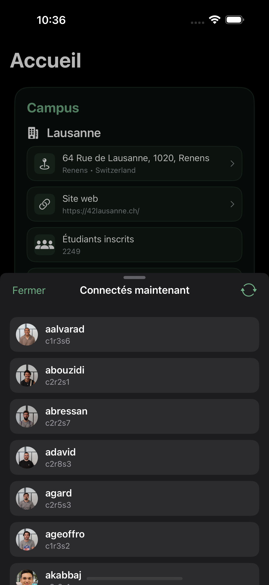
	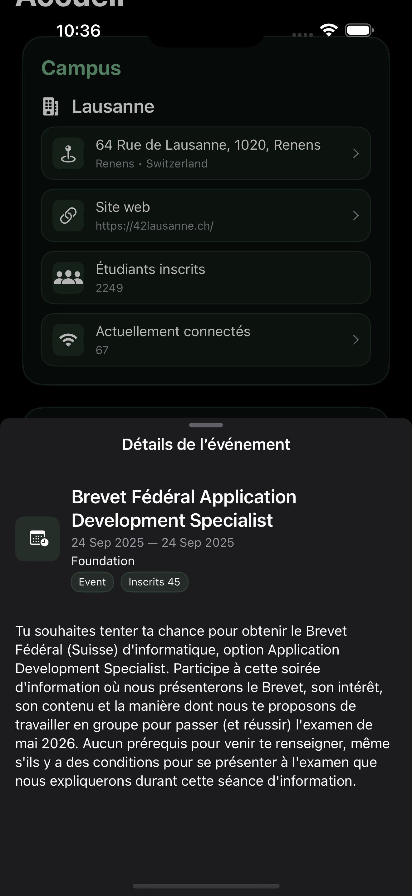
</div>

### Login

<div align="center">
	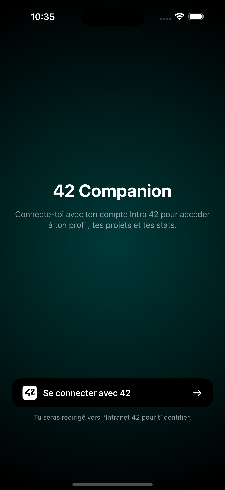
	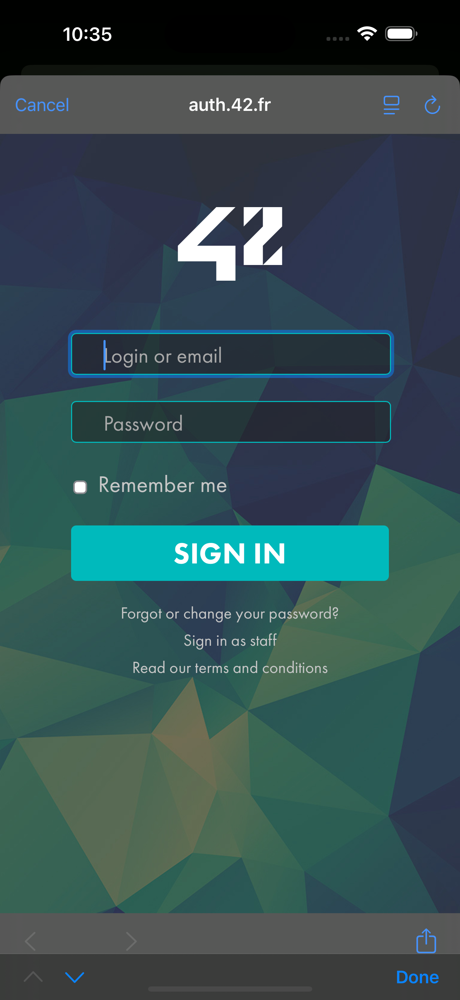
</div>

### Profile

<div align="center">
	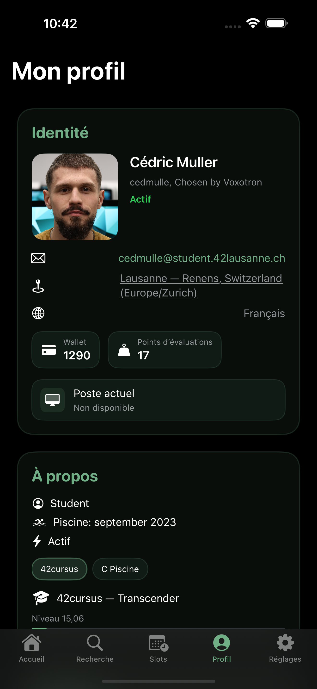
	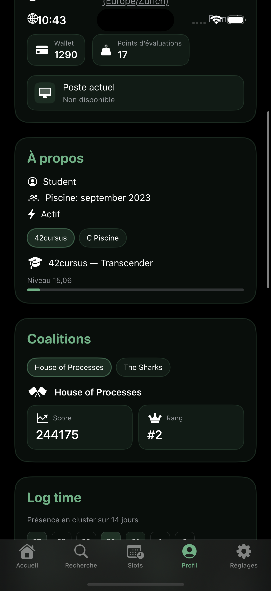
	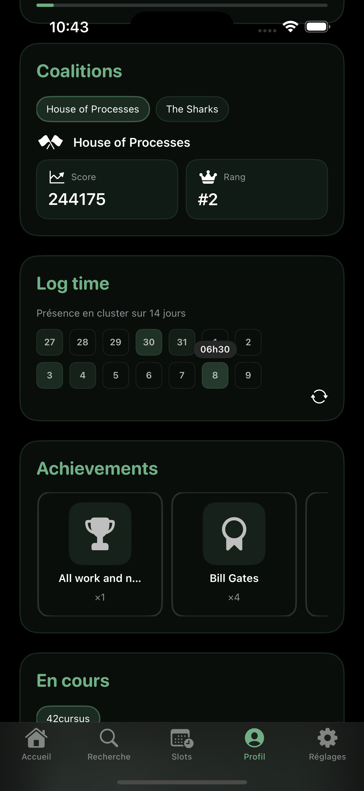
	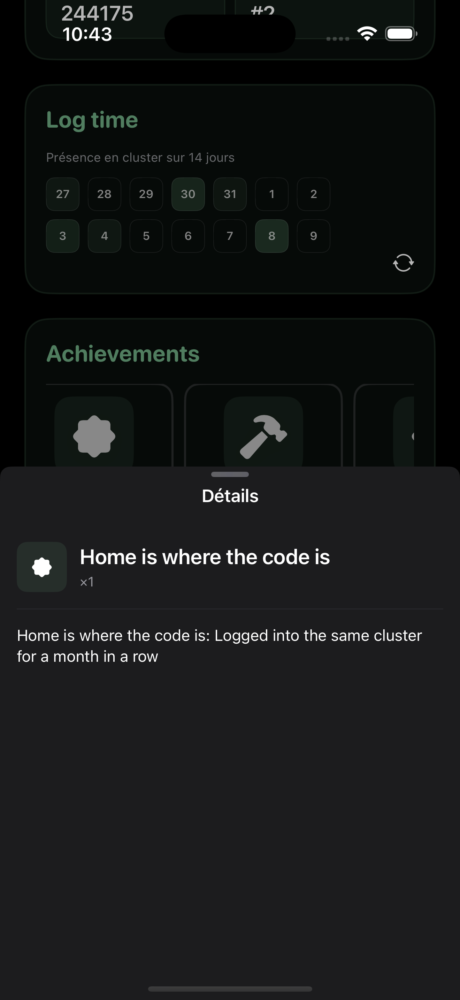
	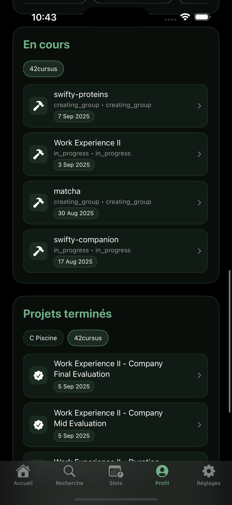
	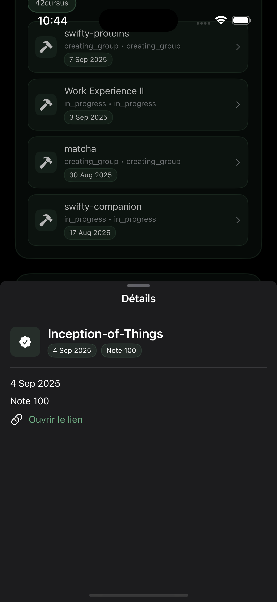
	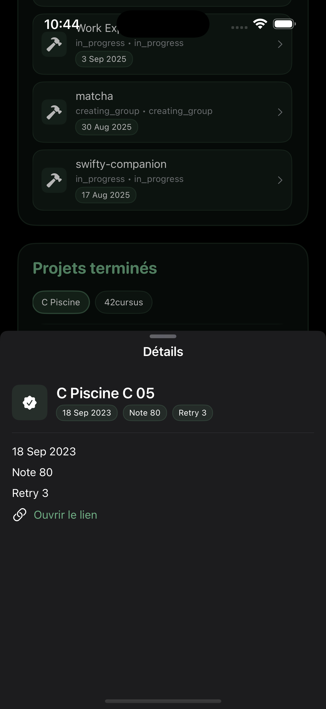
</div>

### Search

<div align="center">
	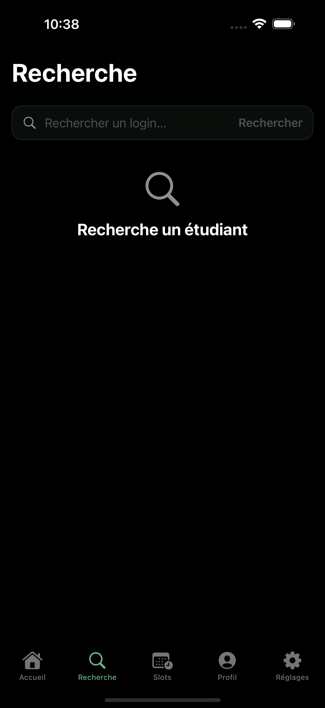
	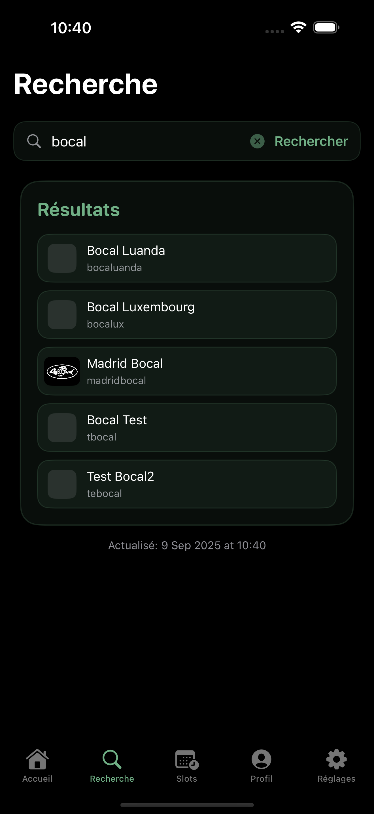
</div>

### Settings

<div align="center">
	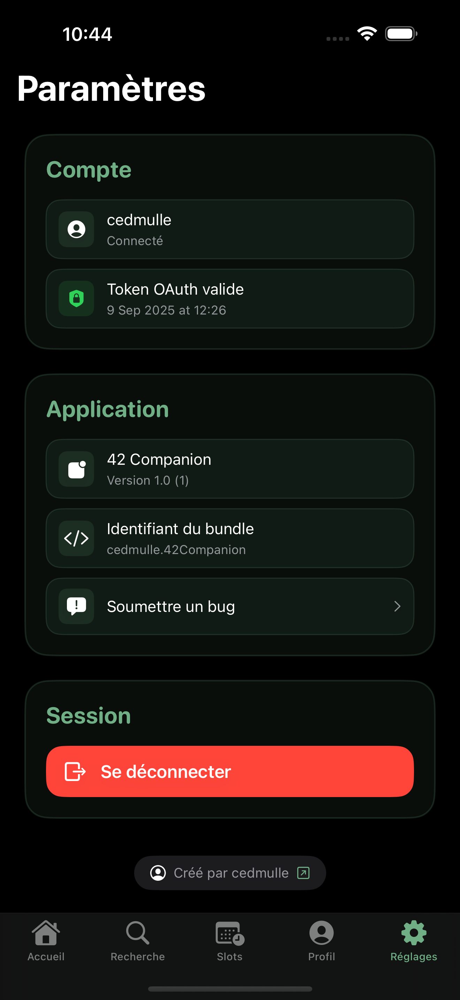
	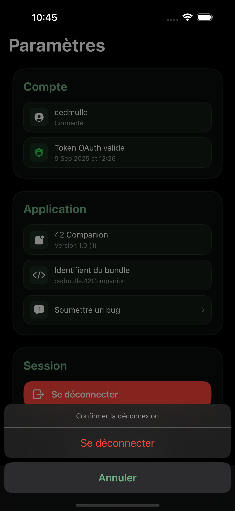
</div>

### Slots

<div align="center">
	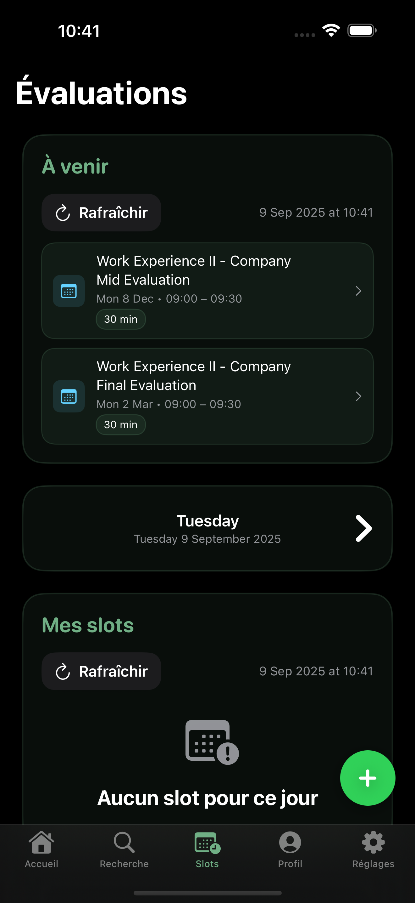
	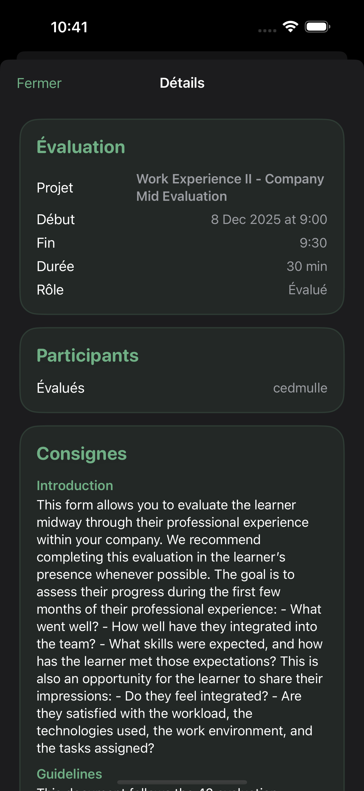
	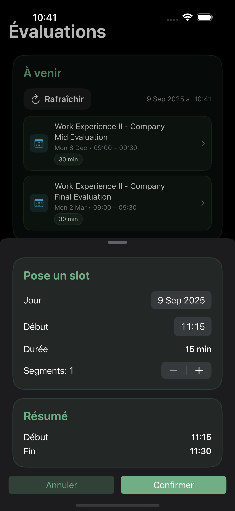
	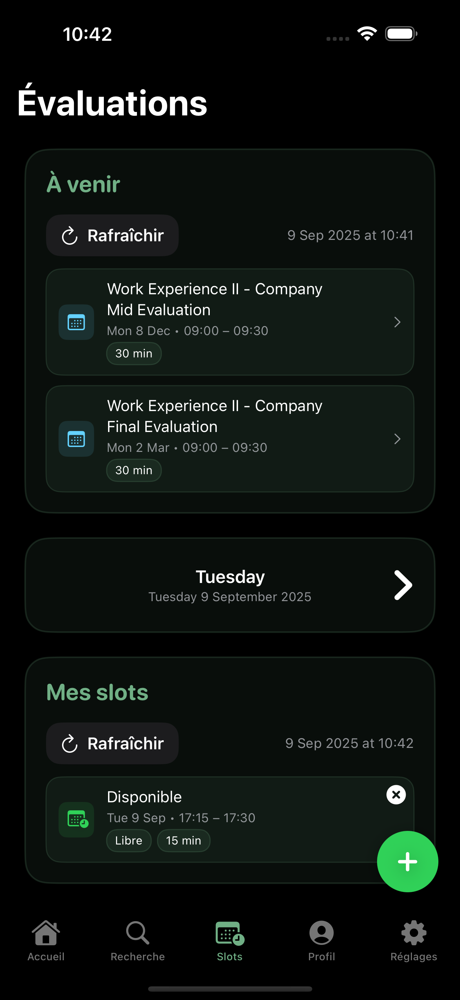
	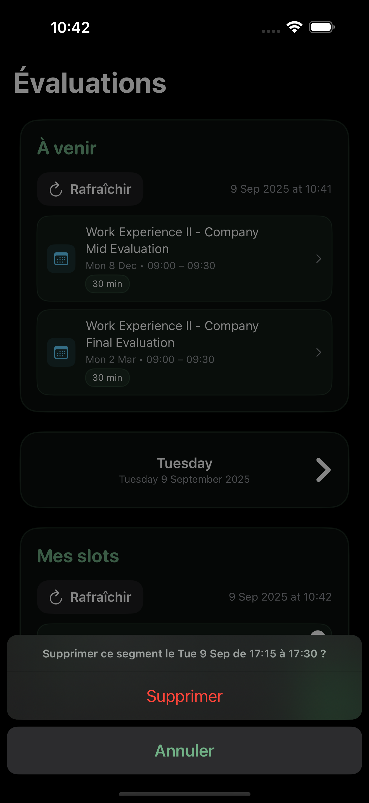
</div>

<br>

## Crédits

- Développement, design & intégration : **cedmulle**
- École 42 — API & assets officiels

<br>

### Points forts pour la soutenance

- Code structuré (SRP), séparation claire UI / Store / Data / Réseau / Auth.
- Actors + Combine + Swift Concurrency : sécurité des accès et UX fluide.
- Résilience réseau (401/429/5xx), caches disque, fallbacks mesurés.
- UI moderne et cohérente (sections, chips, sheets, charts), accessibilité et haptique intégrées.

