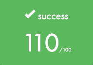

<br>

# Swifty Companion — 42

Application **iOS 17+** en SwiftUI connectée à l’API 42. Affiche ton profil, tes projets, coalitions, log time, slots d’évaluation, campus et permet la recherche d’étudiants.  
Design moderne, performances optimisées, architecture modulaire et évolutive. Sécurité, résilience réseau et UX avancée.

> Mon implémentation dépasse complètement les pré-requis du sujet volontairement, car je souhaitais avoir le maximum de fonctionnalités de l'intranet 42 depuis mon téléphone.

<br>

## Index

- [Sujet](#sujet)
- [Mon implémentation](#mon-implémentation)
- [En détail](#en-détail)
	- [Aperçu](#aperçu)
	- [Fonctionnalités](#fonctionnalités)
	- [Architecture & choix techniques](#architecture--choix-techniques)
	- [Sécurité & résilience réseau](#sécurité--résilience-réseau)
	- [Écrans](#écrans)
	- [Configuration & lancement](#configuration--lancement)
	- [API utilisées](#api-utilisées)
- [Captures d'écrans](#captures-décran)
- [Crédits](#crédits)

<br>

## Sujet

```
- L’application doit comporter au moins 2 vues.  
- Gérer tous les cas d’erreurs (login inexistant, erreur réseau, etc.).  
- La deuxième vue doit afficher les informations du login si celui-ci existe.  
- Afficher au moins 4 informations utilisateur (exemple : login, email, mobile, level, location, wallet, évaluations) + la photo de profil.  
- Afficher les skills de l’utilisateur avec leur niveau et pourcentage.  
- Afficher les projets réalisés (y compris ceux échoués).  
- Permettre de naviguer en arrière vers la première vue.  
- Utiliser une mise en page moderne et flexible (auto-layout, contraintes, etc.) pour s’adapter à toutes les tailles d’écran.  
- Utiliser correctement l’authentification OAuth2 Intra (⚠️ un seul token, pas un par requête).  
- [BONUS] Gestion de la renouvellement automatique du token à l’expiration, de manière transparente pour l’utilisateur.  
```

<br>

## Mon implémentation
| **Consignes** | OK? | **Implémentation** |
|------------------------|:-----:|------------------------------------------|
| L’application doit comporter au moins 2 vues | ✅ | 5 vues principales : Home, Search, Slots, Profile, Settings (`Views/`) |
| Gérer tous les cas d’erreurs (login inexistant, erreur réseau, etc.) | ✅ | Gestion centralisée des erreurs dans chaque ViewModel (`UserSearchViewModel`, `UserProfileLoader`, `SlotsViewModel`). Affichage via `ErrorBanner`, `RetryRow` (`UI/StateDisplays.swift`) |
| La deuxième vue doit afficher les informations du login si celui-ci existe | ✅ | `SearchView` + `UserProfileDetailView` : affichage du profil complet après recherche |
| Afficher au moins 4 informations utilisateur + la photo de profil | ✅ | `UserProfileView` : photo, display name, login, statut, contacts, emplacement, wallets, points d’évaluations, cursus, coalitions, log time, achievements, projets |
| Afficher les skills de l’utilisateur avec leur niveau et pourcentage | ✅ | `UserProfileView` : section skills, niveaux et pourcentages (mapping dans `UserProfile`) |
| Afficher les projets réalisés (y compris ceux échoués) | ✅ | `UserProfileView` : projets actifs/terminés, badge d’état (validé, échoué, retry) via `ProfileRepository` |
| Permettre de naviguer en arrière vers la première vue | ✅ | Navigation SwiftUI (`NavigationStack`, `.sheet`, `.navigationBarBackButtonHidden(false)`) |
| Mise en page moderne et flexible (auto-layout, contraintes, etc.) | ✅ | SwiftUI, layout adaptatif, composants réutilisables (`SectionCard`, `InfoPillRow`, `CapsuleBadge`) |
| Authentification OAuth2 Intra (un seul token, pas un par requête) | ✅ | Token centralisé dans `AuthService` (`Auth/AuthService.swift`), stockage Keychain, injection via `APIClient` |
| BONUS - Gestion du renouvellement automatique du token à l’expiration | ✅ | Boucle de refresh automatique dans `AuthService`, rafraîchissement avant expiration, transparent pour l’utilisateur (`SettingsView`) |

<br>

## En détail
<details>
<summary>Voir ici</summary>

## Aperçu

- Authentification OAuth2 (API 42) via `ASWebAuthenticationSession`, tokens sécurisés en Keychain, refresh automatique avant expiration.
- Profil complet : identité, cursus, coalitions, projets actifs/terminés, log time 14 jours (Swift Charts).
- Recherche d’étudiants par login, résultats contextualisés par campus.
- Dashboard campus : infos, utilisateurs actifs en temps réel, événements à venir.
- Cache local JSON (profil, logs, campus) avec restauration immédiate, auto-refresh périodique.
- UX avancée : skeletons, shimmer, haptique, sections réutilisables, chips de filtre, sheets détaillées.
- Slots d’évaluation : création/suppression par segments de 15 min, confirmation système, feedback haptique, gestion des erreurs.

<br>


## Fonctionnalités

- Authentification sécurisée (OAuth2), boucle de refresh des tokens.
- **Mon Profil** : avatar, wallet, points de correction, hôte courant, contact, statut/piscine, cursus, progression, coalitions, projets actifs/terminés, log time 14 jours.
- **Recherche** : par login, résultats filtrés par campus, ouverture du profil en plein écran.
- **Accueil** : carte campus (adresse, site web, effectifs), liste des utilisateurs actifs, événements à venir.
- **Réglages** : état du compte, validité du jeton, version app, déconnexion.
- **Slots d’évaluation** : création/suppression, feedback haptique, gestion des erreurs et états de chargement.
- **Accessibilité & confort** : skeletons, shimmer, animations snappy, erreurs contextualisées, action Réessayer.

<br>


## Architecture & choix techniques

### Couches principales

#### UI / Views

- **Écrans** : BootView, LoginView, HomeView, SearchView, SlotsPageView, UserProfileView.
- **Composants** : SectionCard, InfoPillRow, CapsuleBadge, LoadingListPlaceholder, WeeklyLogCard (Charts), CreateSlotSheet.
- **Thème** : `Color("AccentColor")` dynamique selon coalition, coins `.continuous`, design épuré, lisibilité prioritaire.

#### Store & Loaders

- **ProfileStore** : accès unique au UserProfileLoader de l’utilisateur connecté.
- **UserProfileLoader** : pipeline orchestré par section (basic/coalitions/projects/host/log), états indépendants, cache disque, refresh périodique (300s), fetch parallélisés, protection contre les races.

#### Données & Mappers

- **Models/UserProfile** + Raw Decodables pour mapping/normalisation (dates ISO, regroupement projets, etc.).
- **Repositories** : ProfileRepository, CampusRepository, SearchRepository, LocationRepository, SlotsRepository.
- **Caches** : ProfileCache, CampusCache (JSON sérialisés, ISO8601, dossier Caches utilisateur).

#### Réseau

- **APIClient (actor)** : URLSession dédié, retry exponentiel + jitter, gestion 429 Retry-After, 401 auto-refresh, pagination centralisée.
- **SecureImageLoader (actor)** : NSCache, déduplication des chargements, Authorization auto pour images privées, backoff exponentiel.

#### Auth

- **AuthService (ObservableObject)** : phases (unknown/unauthenticated/authenticated), Keychain pour tokens, UserDefaults pour expiration/login, refresh loop, récupération du login via `/v2/me`, intégration UI, logout propre.

#### Patterns notables

- Actors pour sérialiser l’accès au réseau/cache et éviter les data races.
- États par section pour une UX progressive.
- Sheets unifiées pour détails d’items, chips pour segmenter par cursus/coalition.
- Charts (Swift Charts) pour le log time, barres et statistiques Total/Moyenne.

<br>


## Sécurité & résilience réseau

- Tokens stockés en Keychain, refresh automatique avant expiration.
- ASWebAuthenticationSession avec state aléatoire, redirect_uri vérifiée.
- Boucle de refresh calée sur l’expiration –1 min, replanifiée après chaque renouvellement.
- **APIClient robuste** :
	- 401 → refresh token et relance unique.
	- 429 → respect du Retry-After.
	- 5xx/URLError → exponential backoff + jitter, limites d’essais.
- Images sécurisées : header Authorization injecté pour les URLs API 42.
- Caches avec TTL, restauration immédiate hors-ligne.

<br>


## Écrans

- **Boot** : initialisation, détection de session.
- **Login** : bouton « Se connecter avec 42 », web auth intégrée, état « Connexion… ».
- **Accueil** : carte campus (nom, adresse, site, effectifs), utilisateurs actifs, événements à venir (sheet détail).
- **Recherche** : champ login, résultats avec avatar/nom/login, ouverture du profil en plein écran.
- **Slots** : création, suppression, affichage des créneaux d'évaluation (sheet responsive, confirmation, feedback visuel/haptique).
- **Profil** :
	- Identité : avatar, title/login, poste actuel, contact, langue du campus.
	- À propos : statut/piscine, cursus avec chips, niveau et progression.
	- Coalitions : chips de sélection, Score/Rang en carte.
	- Log time : histogramme 14 jours, Total et Moyenne.
	- Projets en cours/terminés : items groupés par cursus, tri chronologique, badge Note/Validé/Retry, lien repo si présent (sheet).
- **Réglages** : login courant, validité du jeton, nom/version app, déconnexion confirmée.

<br>


## Configuration & lancement

### Prérequis

- iOS 17+, Xcode 15+
- Compte et application API 42 (Intra) avec redirect URI propre à l’app.

### 1. Secrets & redirect

Dans `Info.plist`, renseigne les clés suivantes :

```plaintext
API_CLIENT_ID = xxxxxxxxxxxxxxxxxxxxxxxxxxxxxxxxxxxxxxxxxxxxxxxx
API_CLIENT_SECRET = yyyyyyyyyyyyyyyyyyyyyyyyyyyyyyyyyyyyyyyyyyyy
API_REDIRECT_URI = myapp42://oauth/callback
```

Ajoute un URL Type dans le target iOS avec le Scheme de la redirect URI (`myapp42`).
Dans le dashboard 42, configure la Redirect URI exacte.

### 2. Build & run

- Sélectionne un device iOS 17+, Build puis Run.
- Écran Login → « Se connecter avec 42 » → consentement → retour à l’app.
- Les tokens sont stockés en Keychain et rafraîchis automatiquement.

<br>


## API utilisées

- `GET /v2/me` — login courant, campus primaire.
- `GET /v2/users/{login}` — profil, titres, cursus, achievements.
- `GET /v2/users/{login}/coalitions`
- `GET /v2/users/{login}/coalitions_users`
- `GET /v2/users/{login}/projects_users` — paginé
- `GET /v2/users/{login}/locations` — actif/récent
- `GET /v2/users/{login}/locations_stats` — agrégats horaires (fallback manuel si indisponible)
- `GET /v2/campus/{id}` — infos campus
- `GET /v2/campus/{id}/locations` — paginé, actifs
- `GET /v2/campus/{id}/events` — paginé, futurs
- `GET /v2/users?search[login]=…` — recherche, page[size]
- `GET /v2/me/slots` — créneaux de l’utilisateur courant (journée).
- `POST /v2/slots` — création d’un créneau d’évaluation.
- `DELETE /v2/slots/{id}` — suppression d’un créneau.

Gestion centralisée des pages et du header Link dans APIClient.

</details>

<br>

## Captures d'écran

### Login

<div align="center">
	
	
</div>

---

### Home

<div align="center">
	
	
	
	
</div>

---

### Profile

<div align="center">
	
	
	
	
	
	
	
</div>

---

### Search

<div align="center">
	
	
</div>

---

### Slots

<div align="center">
	
	
	
	
	
</div>

---

### Settings

<div align="center">
	
	
</div>

<br>

## Crédits

- Développement, design & intégration : **cedmulle**
- École 42 — API & assets officiels

<br>

## Grade


